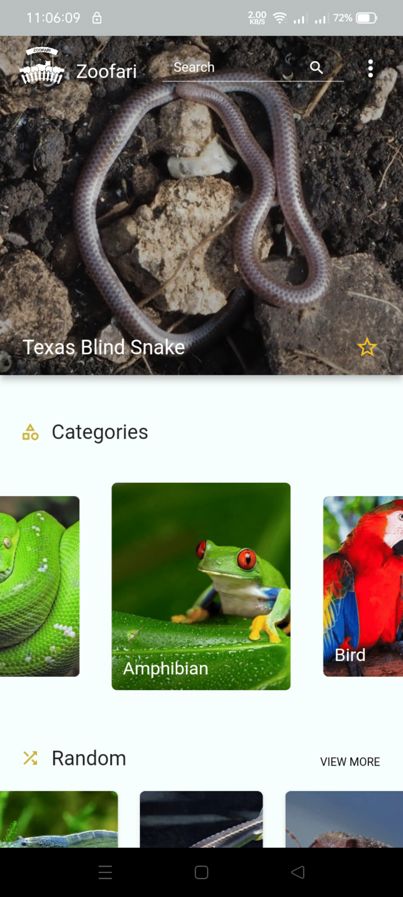
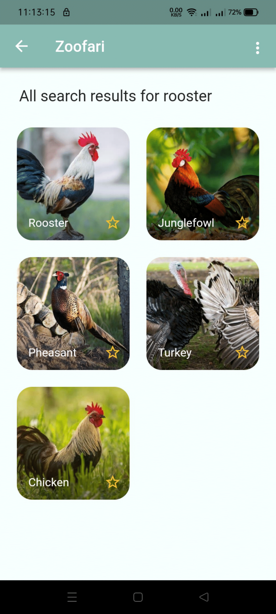

# zoofari

An Android and IOS application built using Flutter with the core feature as the availability of information and pictures of different species of animals to aid children to learn more about them.

## Functionalities

The function that this mobile application is aimed to provide are the following -
- Seamless viewing UI
- View animals of different categories
- View the details of the clicked animal
- Infinite scroll feature for viewing categorized animals
- Save to/remove from favorite animal list 
- View favorite animals
- Search for animal/s
- Go through search results
  

  
  
  
  

  
  
  
  

  
  
  
  

  
  
  
  

  
  

